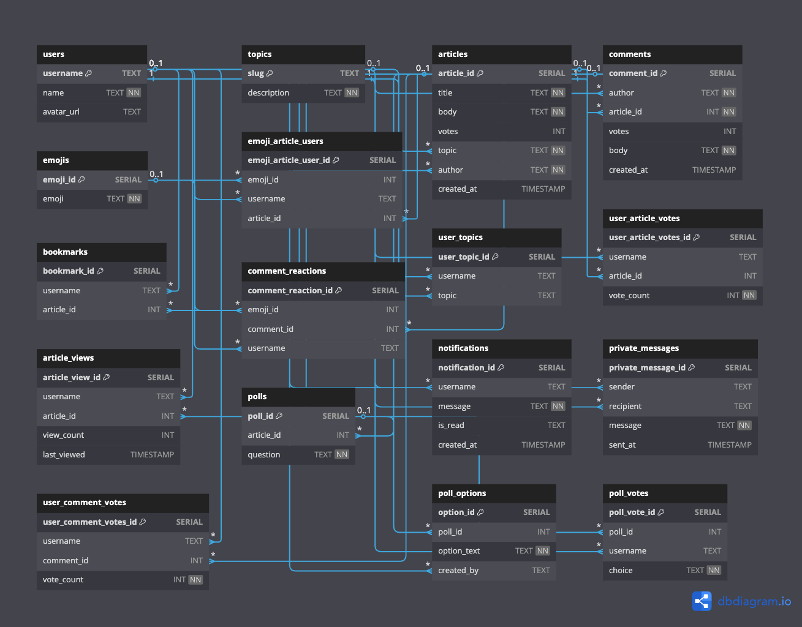

# 📰 NC News API

## 🌍 Hosted Version

You can access the live API here:  

👉 [https://nc-news-api-b3sf.onrender.com](https://nc-news-api-b3sf.onrender.com)

## 📦 Project Summary

This is a RESTful API built with Node.js, Express, and PostgreSQL.  

It serves up topic, article, user, and comment data for a fictional news website and supports dynamic queries, pagination, and robust error handling.

## ⚙️ Environment Setup

To run this project locally, create the following files in the **root** directory:

- `.env.test`  

  ```env
  PGDATABASE=nc_news_test
  ```

- `.env.development`  

  ```env
  PGDATABASE=nc_news
  ```

✅ **Make sure your `.gitignore` includes `.env.*`**

## 🚀 Getting Started

1. Clone this repository and install dependencies:

   ```bash
   git clone https://github.com/YOUR-USERNAME/nc-news.git
   cd nc-news
   npm install
   ```

1. Create the environment files in the root:

- `.env.development`

  ```env
  PGDATABASE=nc_news
  ```

- `.env.test`

  ```env
  PGDATABASE=nc_news_test
  ```

1. Set up and seed the local databases:

   ```bash
   npm run setup-dbs
   npm run seed
   ```

1. Run the test suite:

   ```bash
   npm test
   ```

✅ Make sure `.env.*` files are listed in `.gitignore`

## Entity Relationship Diagram - Database

[Link to dbdiagram.io](https://dbdiagram.io/d/NC-News-683992adbd74709cb74712d4): for better view of relations

### Double click image if link doesn't work to view png



---

## 💡 Developer Tips

This project uses the **Better Comments** extension in VS Code to improve in-editor readability.

>
>💬 Comments in the code are color-coded based on type:
>- `// TODO:` = 🟡 To-Do
>- `// !` = 🔴 Warning
>- `// ?` = 🔵 Question
>- `// *` = 🟢 Highlight
>

🔧 You can install this from the [Visual Studio Marketplace](https://marketplace.visualstudio.com/items?itemName=aaron-bond.better-comments) to see annotations as intended.

## 📐 Tech Requirements

- Node.js version: >= 20.x  
- PostgreSQL version: >= 15.x
